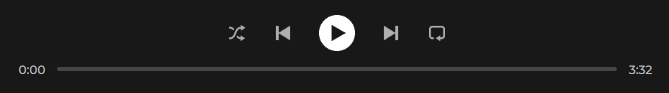
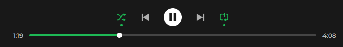
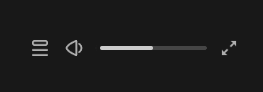

  

# Spotify Clone App

React clone of the **Spotify** application.  
In order to understand React in practice, I needed some application to learn from, but I didn't want to make YouTube or Netflix, and as I love listening to music while programming, I thought that Spotify was the best choice.  
 

 # Application screenshots

> ## Screenshot #1
>
>   

> ## Screenshot #2
>
>   
 

 # Current features

> ##  Navbar
> 
> ### Main navigation tool
>  
> 
> 
> ## Notes:
>
> ### Currently working:
>
> - Home
> - Liked Songs  
>  

 

> ##  Playlists
> 
> ### Redirects you to the playlist screen (more about that below) of your choice
>
>   
 

> ##  Current song tile
> 
> ### Displays current song's image, title and author
>
> 
>
> ## Notes:  
> 
> ### Like song button doesn't work (but shows if the song is in **liked songs playlist**)
> ### If title / authors list is too long and you hover over it, the scrolling animation will activate
 

> ##  Playbar
> 
> ### Buttons:
>
> - Shuffle songs: OFF / ON
> - Previous song
> - Play / Pause
> - Next song
> - Repeat songs: OFF / ON / one song
>
> ### Shows song's current time, song's duration
>
> ### Song bar shows song's progression and let's you wind / rewind the song
>
> 
> 
 

> ##  Soundbar
> 
> ### Buttons:
>
> - Queue (not working)
> - Mute / Unmute sound (icon changes on mute / over 0% / over 30% / over 60%)
> - Fullscreen (not working)
>
> ### Soundbar shows current volume and let's you turn the sound up / down
>
> 
 

> ## Playlist screen
>
> ### Features:
>
> - Playlist image:
>   - Playlist's image if it has one
>   - Sets first song's image as playlist image (if playlist has songs with less than 4 different songs images)
>   - Sets first 4 songs images as playlist image (if if playlist has songs with 4 or more different songs images) - ***image below***
> - Playlist info:
>   - Privacy (playlist public or private)
>   - Title
>   - Author
>   - Songs count
> - Play current playlist button (Play / Pause if it's currently playling playlist)
> - Songs list:
>   - Number (if it's current song playing - little animation starts playing instead)
>   - Song image, title and author
>   - Song's duration
>
> 
 