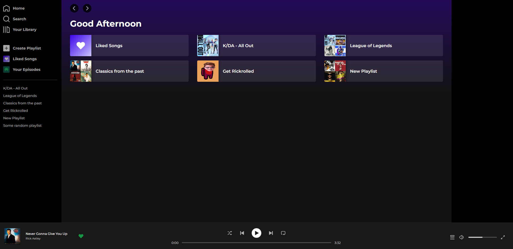
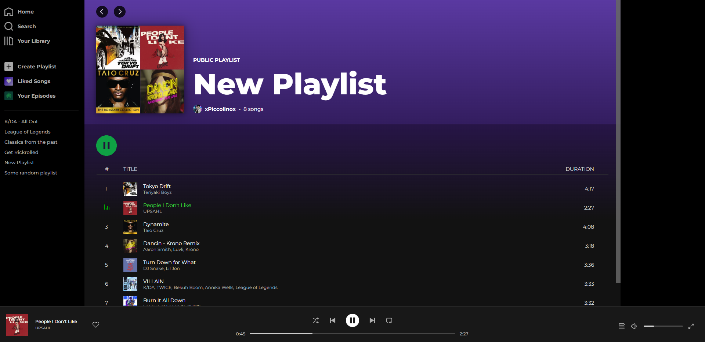
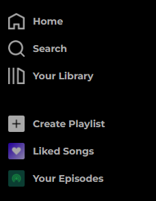
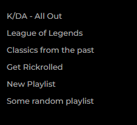
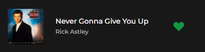

  

# Spotify Clone App

React clone of the **Spotify** application.  
In order to understand React in practice, I needed some application to learn from, but I didn't want to make YouTube or Netflix, and as I love listening to music while programming, I thought that Spotify was the best choice.  
 

 # Application screenshots

> ## Screenshot #1
>
>   

> ## Screenshot #2
>
>   
 

 # Current features

> ##  Navbar
> 
> ### Main navigation tool
>  
> 
> 
> ## Notes:
>
> ### Currently working:
>
> - Home
> - Liked Songs  
>  

 

> ##  Playlists
> 
> ### Redirects you to the playlist screen (more about that below) of your choice
>
>   
 

> ##  Current song tile
> 
> ### Displays current song's image, title and author
>
> 
>
> ## Notes:  
> 
> ### Like song button doesn't work (but shows if the song is in **liked songs playlist**)